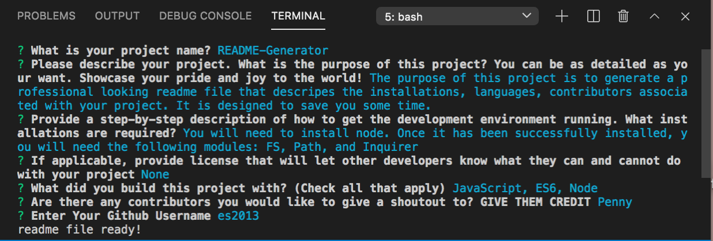

# README Generator
AS A developer
I WANT a README generator
SO THAT I can quickly create a professional README for a new project
## Description
This project is meant to help create a professional looking readme markdown file that includes relevant installations, languages, contirbutors and more. You just have to answer a few basic questions and voila -- a new readme.md will be created in the 'stored' folder.

## Installations
This project uses the following node modules: inquirer, fs, path

## Languages
JavaScript,ES6,Node

## Usage

## Author/Contact profile
[es2013](https://github.com/${es2013})

